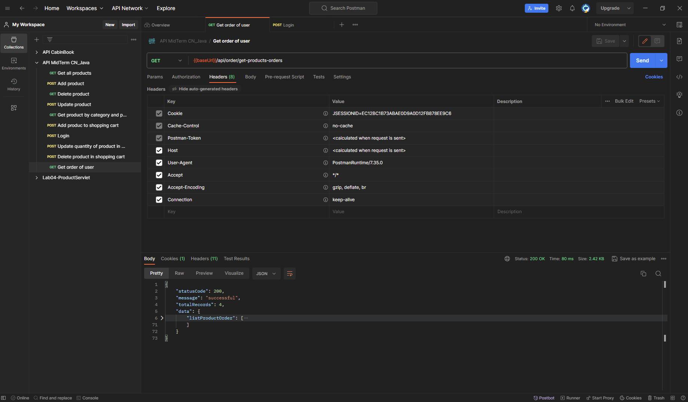
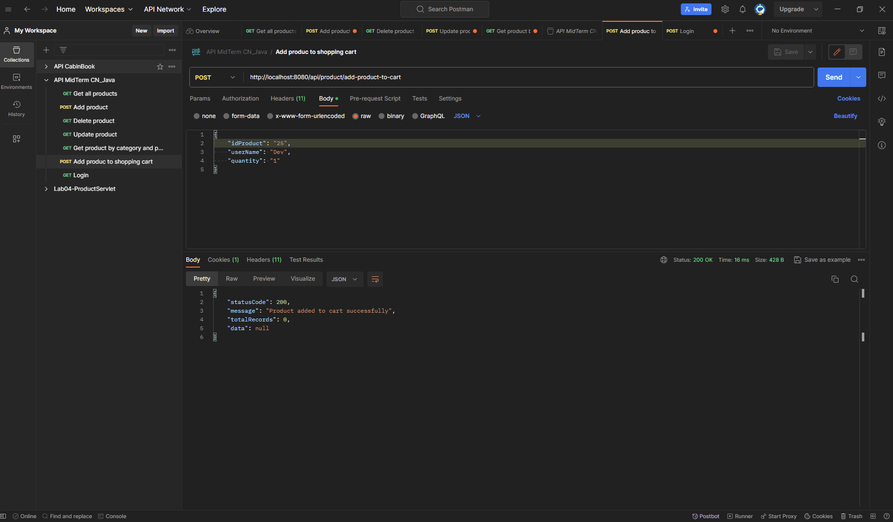
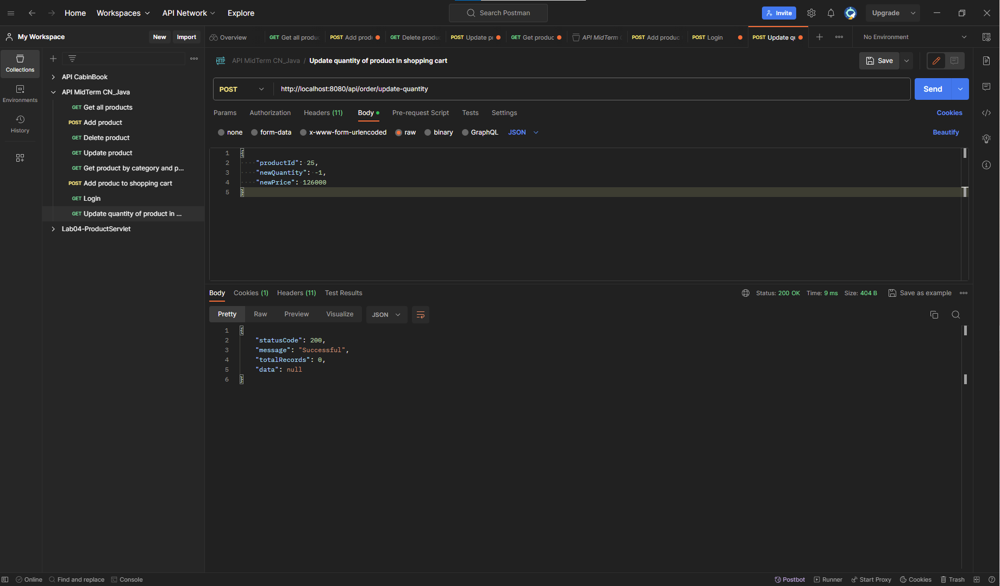
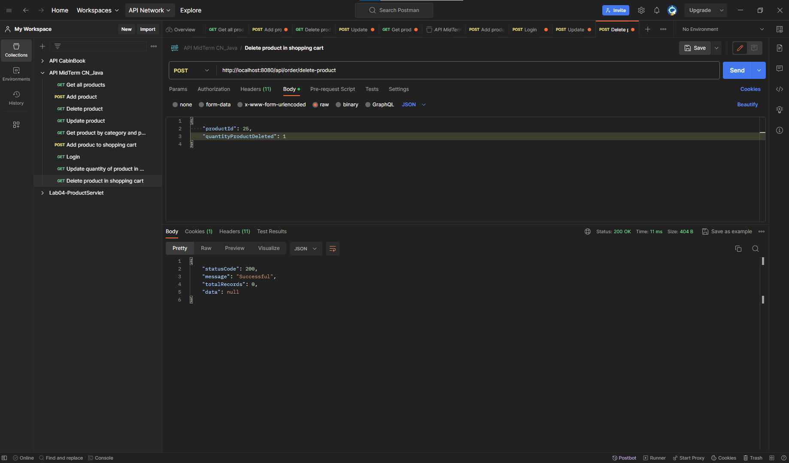

# Mid-Term Java

## Table of contents

### 1. Project description 
### 2. ERD
### 3. Screenshort API
### 4. Implementation instructions

## 1.Project description 

 - The project is a website selling cakes.
 - Hierarchical implementation: administrators and users. The project
   used spring security 6.
 - Project functions, by role:
	 - **Administrators**: Display products, search products , add, delete, and basic edits.
	 - **User**: 
		 - Display products by category, sort by price, by subcategory, search
		   products by name. 
		 - View product details
		 - Add products to the cart, add, delete, and edit products in the cart.
		 - Finally place an order.

## 2.ERD


## 3.Screenshort API
### Product
 - Get all product


 - Add product


 - Update product
 

 - Delete product
 


### Order
 - Get order of user


 - Add product to shopping cart


 - Update order
 

 - Delete order
 

## 4.Implementation instructions
- Step 1: Clone the source code using the command:
```bash
git clone https://github.com/Kienminho/Midterm-JAVA.git
```
- Step 2: Turn on xampp, access phpmyadmin, and import the database file in the folder you just cloned.
- Step 3: Open the project with Intellij and access the file src/main/resources/application.properties, change the username and password of xampp
```bash
spring.datasource.username=root
spring.datasource.password=
```
- Step 4: Running projects
