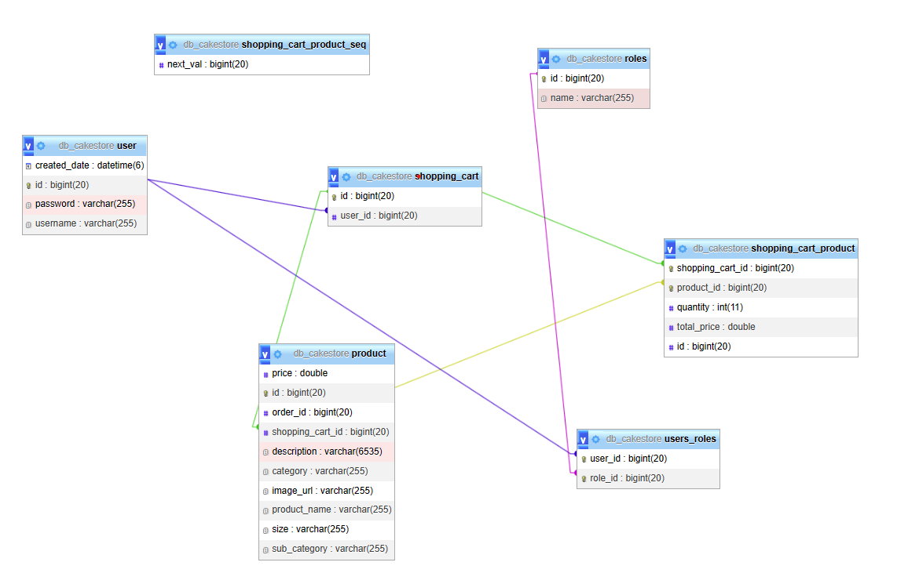
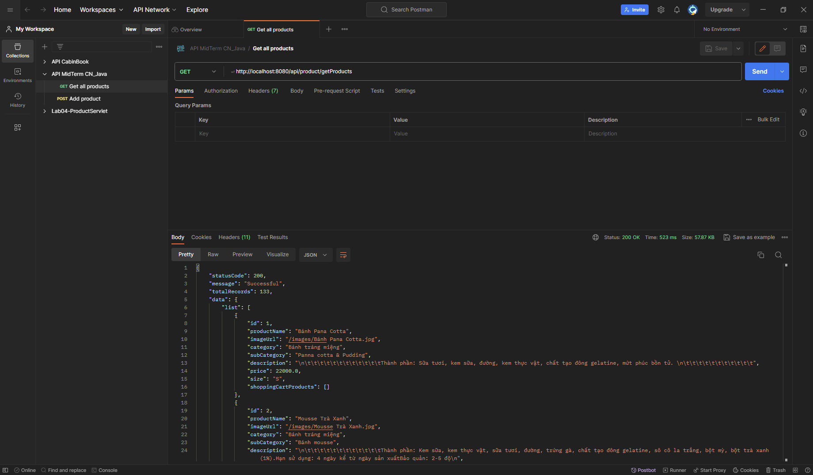
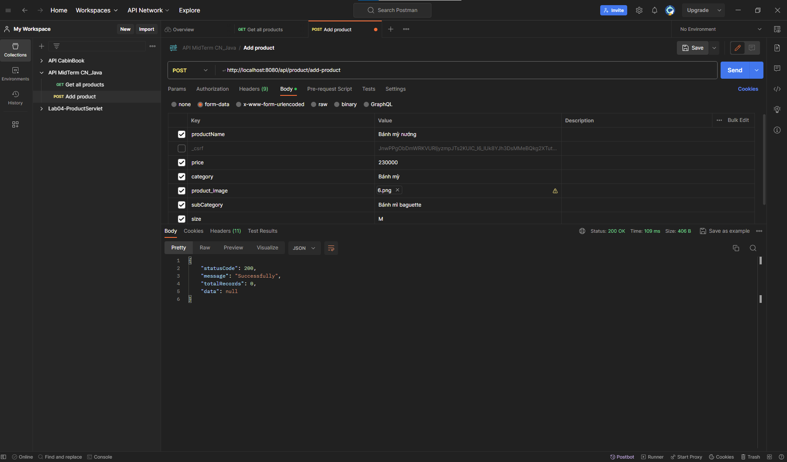
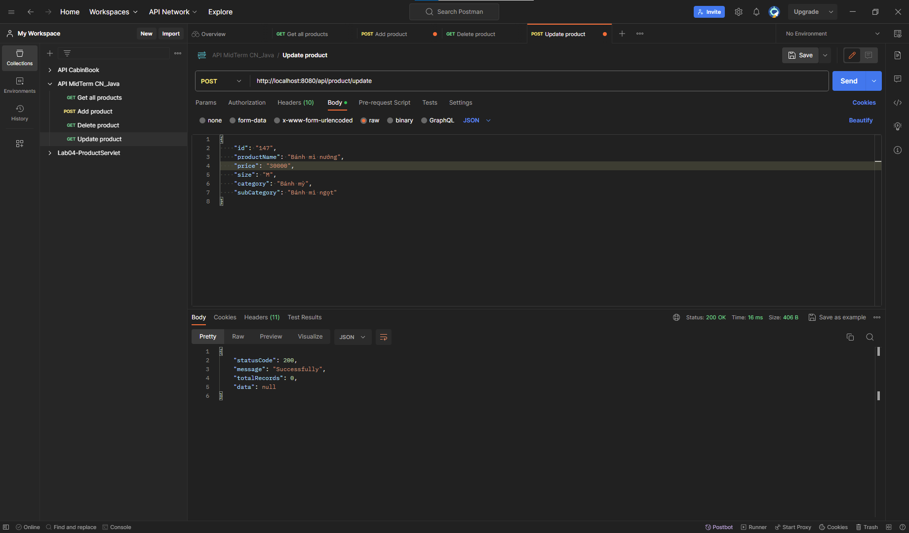
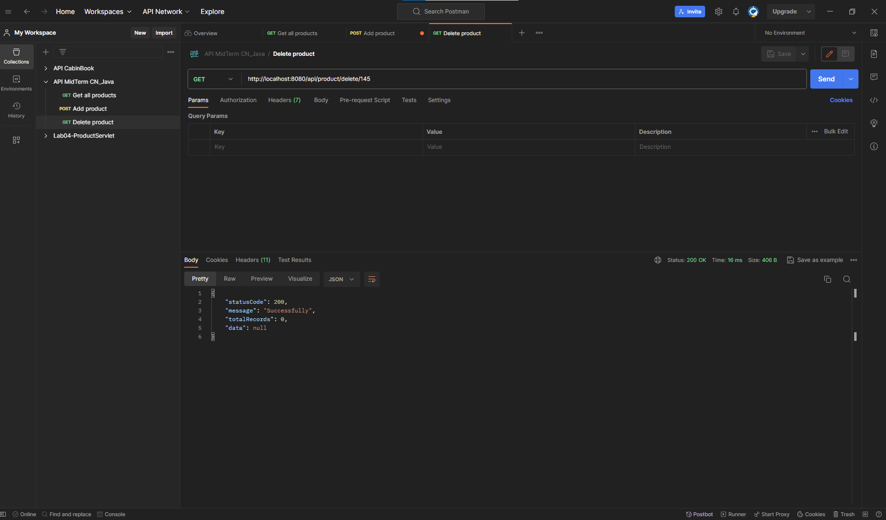

# Mid-Term Java

## Table of contents

### 1. Project description 
### 2. ERD
### 3. Screenshort API
### 4. Implementation instructions

## Project description 

 - The project is a website selling cakes.
 - Hierarchical implementation: administrators and users. The project
   used spring security 6.
 - Project functions, by role:
	 - **Administrators**: Display products, search products , add, delete, and basic edits.
	 - **User**: 
		 - Display products by category, sort by price, by subcategory, search
		   products by name. 
		 - View product details
		 - Add products to the cart, add, delete, and edit products in the cart.
		 - Finally place an order.

## ERD

## Screenshort API
### Product
 - Get all product

 - Add product

 - Update product
 

 - Delete product
 
